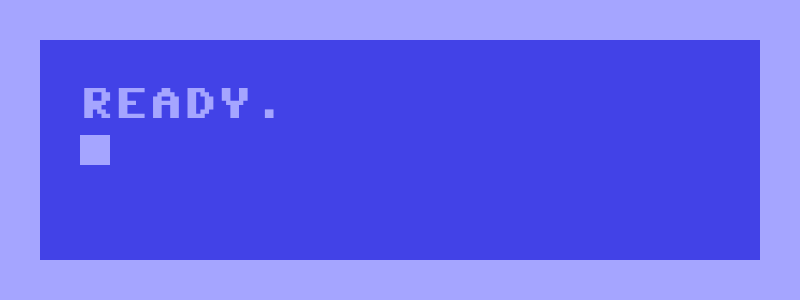

[](https://hayesmaker.github.io/c64-ready/)

# c64-ready

`c64-ready` is a TypeScript/Vite frontend prototype for running and rendering a Commodore 64 emulator in the browser.

It is based on `c64.js (from lvllvl.com by James)` from the original project source: https://github.com/jaammees/lvllvl

## Goal

Build a clean, testable C64 emulator for the web, with a focus on:

- low-level WASM access,
- emulator control/state,
- canvas-based rendering
- node based headless rendering
- framework agnostic integration

### Live URL

https://hayesmaker.github.io/c64-ready/

## Install and run locally
- Prerequisites: Node.js 18+ and npm (see https://nodejs.org/)

Install dependencies:

```zsh
npm install
```

Start the dev server:

```zsh
npm run dev
```

Create a production build:

```zsh
npm run build
```

## Unit tests

This project uses Vitest with a jsdom environment (Jest-like API, faster integration with Vite/TypeScript).

Run tests:

```zsh
npm test
```

Run tests in watch mode:

```zsh
npm run test:watch
```

## Headless streaming (Docker)

The headless player can stream the C64 output over RTMP / HTTP-FLV using Docker Compose.
Two containers are started:

| Container | Role |
|-----------|------|
| `c64-nms` | [Node Media Server](https://github.com/illuspas/Node-Media-Server) — RTMP ingest on `:1935`, HTTP-FLV on `:8000` |
| `c64-headless` | Headless C64 emulator — encodes frames with ffmpeg and pushes to NMS over RTMP |

**Prerequisites:** Docker and Docker Compose v2.

### Quick start

```zsh
# 1. Copy the env file (optional — defaults boot to BASIC, stream forever)
cp docker/.env.example docker/.env

# 2. Build and start both services
docker compose up --build

# 3. Watch the stream
ffplay rtmp://localhost:1935/live/c64
# or open in VLC / OBS: http://localhost:8000/live/c64.flv
```

### Load a cartridge

Games are bind-mounted from `public/games/` — no rebuild needed:

```zsh
GAME_PATH=/app/public/games/cartridges/legend-of-wilf.crt docker compose up
```

### Environment variables

All options can be set in `.env` or passed inline. See `docker/.env.example` for the full list.

| Variable | Default | Description |
|----------|---------|-------------|
| `WASM_PATH` | `/app/public/c64.wasm` | Path to the WASM binary inside the container |
| `GAME_PATH` | *(empty)* | Cartridge/disk to load — leave blank to boot to BASIC |
| `RTMP_URL` | `rtmp://nms:1935/live/c64` | Stream destination (RTMP URL or file path) |
| `FPS` | `50` | Target frame rate (50 = PAL, 60 = NTSC) |
| `AUDIO` | *(empty)* | Set to `1` to mux SID audio (AAC) into the stream/recording |
| `DURATION` | *(empty = forever)* | Stop after this many seconds — omit to stream indefinitely |
| `VERBOSE` | *(empty)* | Set to any non-empty value for per-frame diagnostics |
| `NMS_RTMP_HOST_PORT` | `1935` | Host port mapped to the NMS RTMP ingest |
| `NMS_HTTP_HOST_PORT` | `8000` | Host port mapped to the NMS HTTP-FLV endpoint |

### Stop

```zsh
docker compose down
```

## Headless Input API

When the headless emulator is started with `--input` (or `INPUT_ENABLED=1` in Docker), it opens a **WebSocket server** on port `9001` (configurable via `--ws-port` / `WS_PORT`).

Any client — browser, Node script, or bot — can connect and send JSON messages to control the emulator in real-time.

### Connection & handshake

On connect the server immediately sends a `hello` frame:

```json
{
  "type": "hello",
  "protocol": "c64-input",
  "version": 1,
  "joystickBitmask": { "up": 1, "down": 2, "left": 4, "right": 8, "fire": 16 }
}
```

### Wire protocol (client → server)

**Joystick** — the emulator holds the direction for exactly as long as the client holds it.
A `release` **must** be sent explicitly when the physical (or virtual) button is lifted.
Never infer release from a timer — if the release message is not sent the direction will stick indefinitely.

```json
{ "type": "joystick", "action": "push",    "joystickPort": 2, "direction": "up" }
{ "type": "joystick", "action": "release", "joystickPort": 2, "direction": "up" }

{ "type": "joystick", "action": "push",    "joystickPort": 2, "fire": true }
{ "type": "joystick", "action": "release", "joystickPort": 2, "fire": true }
```

**Keyboard** — use the C64 key code (integer):

```json
{ "type": "key", "action": "down", "key": 65 }
{ "type": "key", "action": "up",   "key": 65 }
```

### Client example — Node.js

A minimal Node.js client that connects, waits for the handshake, then mirrors `keydown` / `keyup`-style events from the calling code as explicit `push` / `release` pairs:

```js
import { WebSocket } from 'ws'; // npm install ws

const ws = new WebSocket('ws://localhost:9001');
let ready = false;

// --- helpers ---------------------------------------------------------

function joystickPush(port, direction, fire) {
  if (!ready) return;
  ws.send(JSON.stringify({ type: 'joystick', action: 'push', joystickPort: port, direction, fire }));
}

function joystickRelease(port, direction, fire) {
  if (!ready) return;
  ws.send(JSON.stringify({ type: 'joystick', action: 'release', joystickPort: port, direction, fire }));
}

// --- lifecycle -------------------------------------------------------

ws.on('open', () => console.log('connected'));

ws.on('message', (data) => {
  const msg = JSON.parse(data);
  if (msg.type !== 'hello') return;
  console.log('server ready, protocol version', msg.version);
  ready = true;
});

ws.on('close', () => console.log('disconnected'));
ws.on('error', (err) => console.error('ws error:', err.message));

// --- usage -----------------------------------------------------------
// Drive push/release from your own input events, e.g.:
//
//   gamepad 'buttondown' event fires  → joystickPush(2, 'up')
//   gamepad 'buttonup'   event fires  → joystickRelease(2, 'up')
//
// Example: a simple readline-driven test sequence
import readline from 'readline';

const rl = readline.createInterface({ input: process.stdin });
rl.on('line', (line) => {
  const [action, direction] = line.trim().split(' ');
  if (action === 'push')    joystickPush(2, direction);
  if (action === 'release') joystickRelease(2, direction);
  if (action === 'quit')    ws.close();
});
```

Run it and type `push up` / `release up` to move the joystick while the emulator is streaming.

### Client example — Browser

The browser's built-in `WebSocket` works the same way — useful for a frontend that streams video via flv.js and sends keyboard/joystick input back:

```js
const ws = new WebSocket('ws://localhost:9001');

ws.addEventListener('message', (evt) => {
  const msg = JSON.parse(evt.data);
  if (msg.type !== 'hello') return;
  console.log('c64-input server ready');
});

// Map keyboard events → C64 key codes and send them
document.addEventListener('keydown', (evt) => {
  ws.send(JSON.stringify({ type: 'key', action: 'down', key: evt.keyCode }));
});
document.addEventListener('keyup', (evt) => {
  ws.send(JSON.stringify({ type: 'key', action: 'up', key: evt.keyCode }));
});
```

### Using `InputBridge` helpers (TypeScript / ESM)

`InputBridge` ships static encoder helpers so you don't have to hand-roll JSON strings:

```ts
import { InputBridge } from 'c64-ready/src/headless/input-bridge';

// Encode a joystick push and release
const push    = InputBridge.encodeJoystick(2, 'push',    'right');
const release = InputBridge.encodeJoystick(2, 'release', 'right');

// Encode fire button
const firePush    = InputBridge.encodeJoystick(2, 'push',    undefined, true);
const fireRelease = InputBridge.encodeJoystick(2, 'release', undefined, true);

// Encode a keypress
const keyDown = InputBridge.encodeKeypress(65, 'down'); // 'A'
const keyUp   = InputBridge.encodeKeypress(65, 'up');

// Send push on button-down, release on button-up — never infer release from a timer
gamepad.on('buttondown', (btn) => ws.send(InputBridge.encodeJoystick(2, 'push',    btn.direction)));
gamepad.on('buttonup',   (btn) => ws.send(InputBridge.encodeJoystick(2, 'release', btn.direction)));
```

### Docker — enabling input

Expose the WebSocket port and set `INPUT_ENABLED=1` in `docker/.env` (or inline):

```zsh
INPUT_ENABLED=1 WS_PORT=9001 docker compose up
```

Then connect your client to `ws://localhost:9001`.

## Using c64-ready as an npm package

`c64-ready` can be installed as a dependency and used in three ways:

| Use-case | How |
|---|---|
| Run the browser player locally | `npx c64-ready` (zero config) |
| TypeScript / Node API | `import` from sub-path exports |
| Vite browser app | Copy or re-use `src/player/*` with your own Vite project |

### Prerequisites

The TypeScript compiled outputs (`dist-ts/`) must be present in the package. They are
generated by `npm run package:build` (`npm run build && npm run headless:build`) before
publishing. A published release on npm will always contain them.

### Running the browser player

After installing the package globally, or via `npx`, the `c64-ready` command starts a
lightweight static HTTP server that serves the pre-built browser player:

```zsh
# Run without installing (npx caches the package automatically)
npx c64-ready

# Or install globally and run
npm install -g c64-ready
c64-ready
```

Open the URL printed to the terminal in any modern browser:

```
  C64 Ready player is running.

  ➜  Local:   http://localhost:5173/c64-ready/
```

**Options:**

| Flag | Default | Description |
|------|---------|-------------|
| `--port <n>` | `5173` | HTTP port to listen on |
| `--host` | localhost | Bind to `0.0.0.0` so the player is reachable on the local network |
| `--help` | | Print usage |

```zsh
# Different port, accessible on the LAN
c64-ready --port 8080 --host
```

> **Note:** `c64-ready` serves the compiled `dist/` directory. If you are working from a
> cloned repo rather than a published package, run `npm run build` first.

### TypeScript / Node.js API

After installing as a local dependency:

```zsh
npm install c64-ready
```

The following sub-path exports are available:

#### Shared types — `c64-ready`

```ts
import type { C64Config, FrameBuffer, AudioBuffer, InputEvent, GameLoadOptions } from 'c64-ready';
```

#### Low-level emulator — `c64-ready/emulator`

`C64Emulator` is the single class all higher-level consumers build on. It owns the WASM
lifecycle and fires `onFrame` / `onAudio` callbacks each tick.

```ts
import { C64Emulator } from 'c64-ready/emulator';

// Load and initialise the WASM binary
const emulator = await C64Emulator.load('/path/to/c64.wasm');

// React to each rendered frame (RGBA pixels, 384 × 272)
emulator.onFrame = (frame) => {
  console.log(`frame ${frame.timestamp}: ${frame.width}×${frame.height}`);
};

// Load a cartridge (.crt file bytes)
const crtBytes = new Uint8Array(await fetch('/games/mygame.crt').then(r => r.arrayBuffer()));
emulator.loadGame({ type: 'crt', data: crtBytes });

// Start the emulation loop
emulator.start();
```

#### Headless emulator — `c64-ready/headless`

`C64Headless` wraps `C64Emulator` for server-side use (Node.js / Deno). It wires up
`FrameCapture`, `AudioCapture`, and `InputBridge` out of the box.

```ts
import { C64Headless } from 'c64-ready/headless';

const headless = new C64Headless('/path/to/c64.wasm');
await headless.init();

// Optional: load a game
const data = new Uint8Array(fs.readFileSync('/path/to/game.crt'));
await headless.loadGame({ type: 'crt', data });

// Step the emulator and capture frames
const { frame, audio } = headless.stepAndCapture(20); // 20 ms step
if (frame) {
  // frame is a Uint8Array of raw RGBA pixels (384 × 272)
}

// Forward remote input from an external source (e.g. WebSocket message)
headless.inputBridge.receiveRemoteInput(
  JSON.stringify({ type: 'joystick', action: 'push', joystickPort: 2, direction: 'up' })
);
```

#### Remote input encoding — `c64-ready/input-bridge`

`InputBridge` provides static helpers so you don't hand-roll input JSON:

```ts
import { InputBridge } from 'c64-ready/input-bridge';

// Joystick
const push    = InputBridge.encodeJoystick(2, 'push',    'right');
const release = InputBridge.encodeJoystick(2, 'release', 'right');
const fire    = InputBridge.encodeJoystick(2, 'push',    undefined, true);

// Keyboard (C64 key code)
const keyDown = InputBridge.encodeKeypress(65, 'down'); // key code 65 = 'A'
const keyUp   = InputBridge.encodeKeypress(65, 'up');

// Send via WebSocket — push on button-down, release on button-up
gamepad.on('buttondown', (btn) => ws.send(InputBridge.encodeJoystick(2, 'push',    btn.direction)));
gamepad.on('buttonup',   (btn) => ws.send(InputBridge.encodeJoystick(2, 'release', btn.direction)));
```

### Using the player in your own Vite app

The browser player (`src/player/*`) uses Vite-specific features (`?raw` CSS imports,
`import.meta.env`) so it is **not** pre-compiled and is shipped as TypeScript source.
Copy the files you need into your own Vite project and import them directly:

```ts
// In your Vite project (TypeScript + Vite)
import { C64Player }     from './vendor/c64-ready/src/player/c64-player';
import CanvasRenderer    from './vendor/c64-ready/src/player/canvas-renderer';
import { AudioEngine }   from './vendor/c64-ready/src/player/audio-engine';

const renderer = new CanvasRenderer('c64-canvas');
const player   = new C64Player({
  wasmUrl:  '/c64.wasm',
  gameUrl:  '/games/mygame.crt',
  renderer,
});

await player.start();
```

Also copy `public/c64.wasm` and `public/audio-worklet-processor.js` into your project's
public directory so they are served alongside your app.

### Building before publish

To regenerate both the Vite browser bundle and the TypeScript API outputs in one step:

```zsh
npm run package:build
# equivalent to: npm run build && npm run headless:build
```

This produces:
- `dist/` — Vite browser bundle (served by `c64-ready` CLI)
- `dist-ts/` — compiled JS + `.d.ts` declarations (imported by API consumers)

## Deployment

The project deploys to GitHub Pages automatically via GitHub Actions.

On every push to `master`:
1. Tests run (`npm test`)
2. If tests pass, a production build is created (`npm run build`)
3. The `dist/` output is deployed to GitHub Pages


## Work in Progress:
- Proof of Concept Implementation:
- [x] WASM module loading and initialization
- [x] Emulator control and state management
- [x] Canvas-based rendering
- [x] Node-based headless rendering
- [x] Framework agnostic integration (e.g., Vanilla HTML+JS, React, Vue, Angular etc)
- Additional features:
- [x] Audio output
- [x] Input handling (keyboard)
- [x] Loading and running .crt cartridge roms
- [x] Display settings
- [x] Docker headless streaming (RTMP / HTTP-FLV via Node Media Server)
- [ ] Gamepad support
- [ ] Touch controls

## Changelog & Releases

See [`docs/CHANGELOG_RELEASES.md`](docs/CHANGELOG_RELEASES.md) for the full release workflow,
changelog generator usage, `tools/release.sh` examples, and authentication notes.

Quick start — bump and push a patch release:

```zsh
npm version patch -m "chore(release): %s"
git push origin master && git push --tags
```

## Docs

Extended documentation lives in the [`docs/`](docs/) folder:

| File | Description |
|------|-------------|
| [`AUDIO_ENGINE.md`](docs/AUDIO_ENGINE.md) | SID audio pipeline, worklet pull-model, timing rules |
| [`HEADLESS_INPUT.md`](docs/HEADLESS_INPUT.md) | Headless WebSocket input API reference |
| [`HEADLESS_RUNNING.md`](docs/HEADLESS_RUNNING.md) | Headless CLI usage, frame/timing rules, ffmpeg integration |
| [`PROJECT_OVERVIEW.md`](docs/PROJECT_OVERVIEW.md) | High-level architecture and design decisions |
| [`CHANGELOG_RELEASES.md`](docs/CHANGELOG_RELEASES.md) | Release workflow, `tools/release.sh`, changelog generator |
| [`WIKI_PUBLISHING.md`](docs/WIKI_PUBLISHING.md) | How to sync `docs/` to the GitHub wiki via `tools/publish_wiki.sh` |

The wiki is kept in sync automatically by the `.github/workflows/publish_wiki.yml` CI workflow
on every push to `master`. To publish manually:

```bash
./tools/publish_wiki.sh git@github.com:YOUR_USER/c64-ready.wiki.git
```

